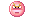

# Yahoo! Messenger Emoticons Reference

The app now uses the original animated Yahoo! Messenger emoticons. Here are all the available emoticon shortcuts:

## Smileys

| Shortcut | Emoticon | Name |
|----------|----------|------|
| `:)` `:-)` |  | Smile |
| `=)` |  | Smiley |
| `:D` `:-D` |  | Grin |
| `;)` `;-)` |  | Wink |
| `:P` `:-P` `:p` |  | Tongue |
| `XD` |  | LOL |
| `:3` |  | Blush |
| `O:)` `o:)` |  | Innocent |

## Expressions

| Shortcut | Emoticon | Name |
|----------|----------|------|
| `:o` `:-o` |  | Open Mouth |
| `:\` `:/` |  | Confused |
| `:|` `:-|` |  | Neutral |
| `:s` `:S` |  | Confounded |
| `D:` |  | Anguished |

## Emotions

| Shortcut | Emoticon | Name |
|----------|----------|------|
| `:'(` |  | Cry |
| `>:(` `>:-(` |  | Angry |
| `>_<` |  | Rage |
| `:*` `:-*` |  | Kiss |
| `<3` |  | Heart |

## Cool

| Shortcut | Emoticon | Name |
|----------|----------|------|
| `B)` `B-)` `8)` |  | Sunglasses |
| `8-)` |  | Glasses |

## How to Use

1. **In Messages**: Just type the shortcut and send your message. The emoticon will automatically appear as an animated GIF.

2. **Using the Picker**: Click the emoticon button (smile icon) in the toolbar to open the emoticon picker, then click any emoticon to insert it into your message.

## Examples

- Type `Hello :)` → Displays "Hello" followed by the smile emoticon
- Type `I love this! :D` → Displays with the grin emoticon
- Type `That's cool B)` → Displays with the sunglasses emoticon
- Type `I miss you :'(` → Displays with the crying emoticon

All emoticons are the original animated GIFs from Yahoo! Messenger for an authentic nostalgic experience!
